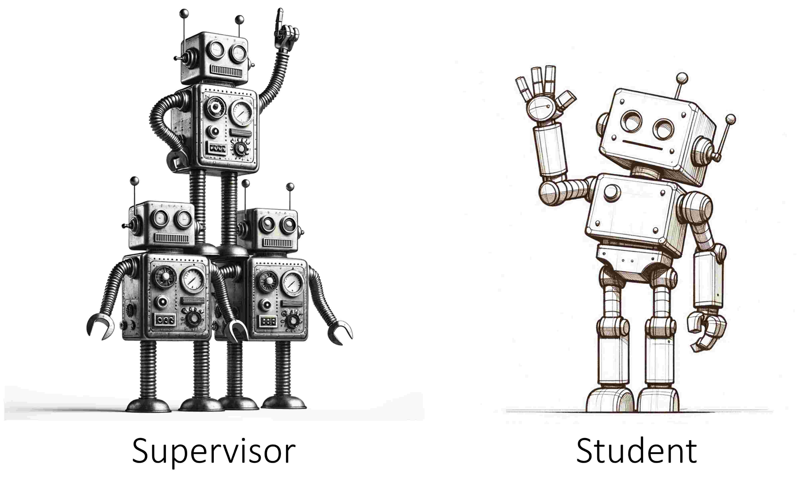
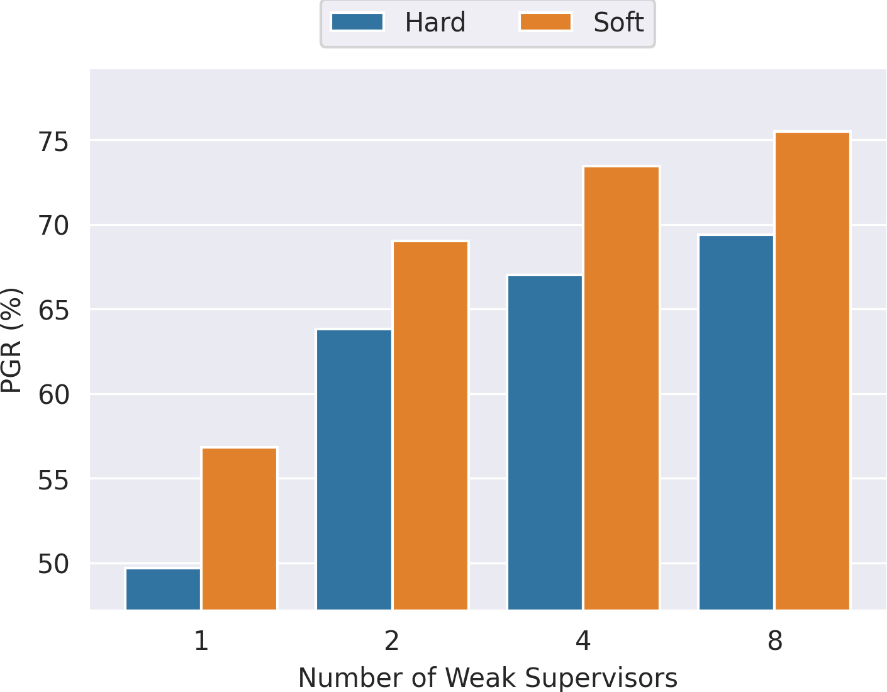

# Co-Supervised Learning

<p align="center">
  
</p>

This repository is the official implementation of
<br>
**[Co-Supervised Learning:
Improving Weak-to-Strong Generalization with Hierarchical Mixture of Experts](https://arxiv.org/abs/2402.15505)**
<br>

> The current codebase is a minimalistic version of [co-supervised learning](https://arxiv.org/abs/2402.15505), built upon the 'vision' directory of [weak-to-strong generalization](https://github.com/openai/weak-to-strong/tree/main/vision). It will be continually maintained and updated in the future. If you have any questions or comments, please feel free to raise issues or email yuejiang.liu[at]{epfl.ch,stanford.edu}.

### Getting Started

Please refer to the [vision directory](vision)

### Expected Results



### Citation

If you find this code useful for your research, please cite the following:

```bibtex
@article{liu2024csl,
  author  = {Yuejiang Liu and Alexandre Alahi},
  title   = {Co-Supervised Learning: Improving Weak-to-Strong Generalization with Hierarchical Mixture of Experts},
  journal = {arXiv preprint 2402.15505},
  year    = {2024},
}
```

### Acknowledgments

- weak-to-strong repository from OpenAI
- pre-trained DINOv2 models from Meta AI
- DomainBed repository from Meta AI
